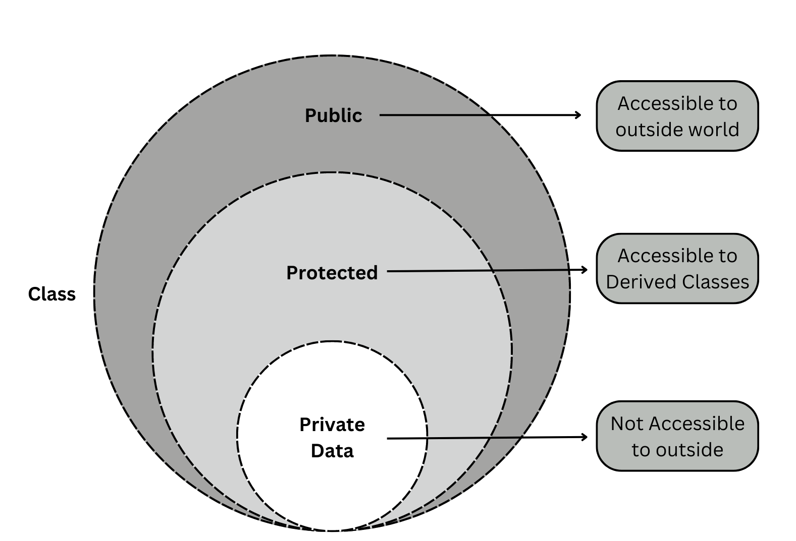
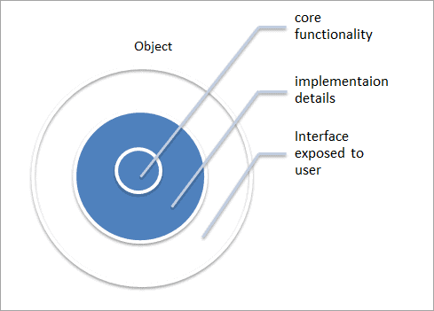
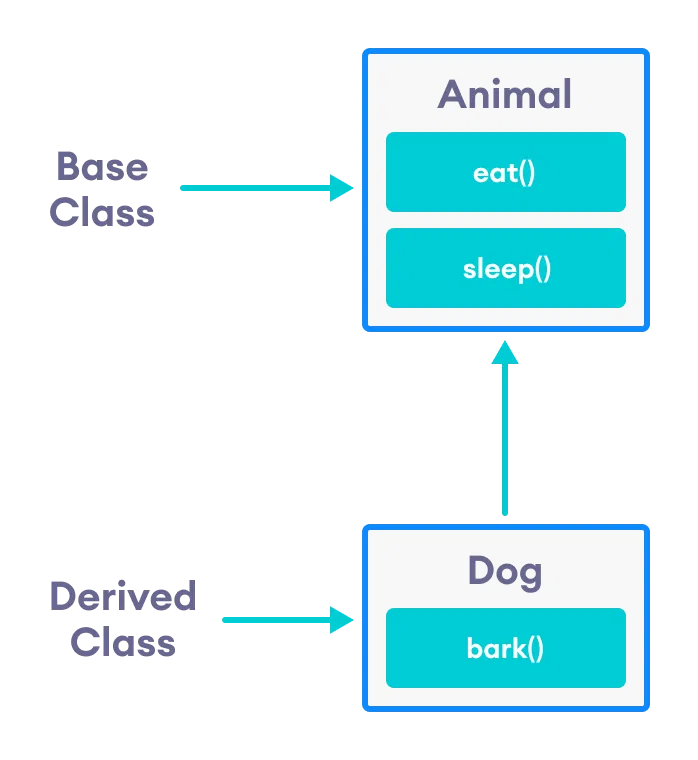
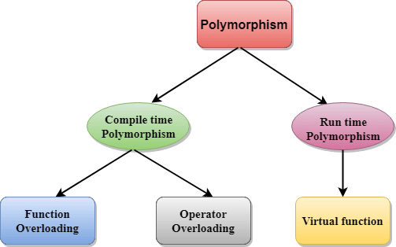

# C/CPP Training

This page will contain C/CPP trainings. There are many problems to solve. let's go!  
## Basic
In C or any other programming language, there are basic definitions for input/output, variables, mathematical operations, flow control and loops.  
This is a simple C program that simulates a network packet counter, a tool you might find in Linux or telecommunications systems to track data packets. It demonstrates fundamental C programming concepts—**primitive variables**, **input/output**, **control flow**, and **loops**—all working together in a practical example.  
### Code: Network Packet Counter Simulator
The code for network packet counter simulator:  
```c
#include <stdio.h>
#include <stdlib.h>
#include <time.h>

int main(){
    int cycles;
    int pkt_per_cycle;
    int lost_pkt;
    float pkt_loss;
    // Seed random number generator
    srand(time(NULL));

    while (1){
        printf("Enter number of cycles (1-10) to process (0 to quit): ");
        scanf("%d", &cycles);
        if (cycles == 0){
            printf("Good Bye!\n");
            break;
        }
        else if (cycles < 1 || cycles > 10){
            printf("Invalid number of cycles. Please enter a number between 1 and 10.\n");
            continue;
        }
        else{
            int pkt_counter = 0;
            int pkt_processed = 0;
            for (int i = 0; i < cycles; i++){
                pkt_per_cycle = rand() % 20 + 1; // 1 to 20
                // Ensure denominator for rand() % n is at least 1
                int max_lost = (pkt_per_cycle / 2) > 0 ? pkt_per_cycle / 2 : 1;
                lost_pkt = rand() % max_lost; // Max loss is half, min 1
                pkt_counter += pkt_per_cycle;
                pkt_processed += pkt_per_cycle - lost_pkt;
                pkt_loss = (float)lost_pkt / pkt_per_cycle * 100;
                printf("Cycle %d: %d packets generated, %d packets lost (%.2f%% loss)\n", i + 1, pkt_per_cycle, lost_pkt, pkt_loss);
            }
            float avg_loss = (float)(pkt_counter - pkt_processed) / pkt_counter * 100;
            printf("Total packets generated: %d\n", pkt_counter);
            printf("Total packets processed: %d\n", pkt_processed);
            printf("Average packet loss: %.2f%%\n", avg_loss);
        }
    }
    return 0;
}
```

to compile this code, simply use:  
```bash
 gcc pkt_counter.c -o pkt_counter
```
The expected output is:
```
./pkt_counter 
Enter number of cycles (1-10) to process (0 to quit): 18
Invalid number of cycles. Please enter a number between 1 and 10.
Enter number of cycles (1-10) to process (0 to quit): 6
Cycle 1: 15 packets generated, 6 packets lost (40.00% loss)
Cycle 2: 16 packets generated, 5 packets lost (31.25% loss)
Cycle 3: 9 packets generated, 2 packets lost (22.22% loss)
Cycle 4: 13 packets generated, 0 packets lost (0.00% loss)
Cycle 5: 15 packets generated, 1 packets lost (6.67% loss)
Cycle 6: 10 packets generated, 1 packets lost (10.00% loss)
Total packets generated: 78
Total packets processed: 63
Average packet loss: 19.23%
Enter number of cycles (1-10) to process (0 to quit): 0
Good Bye!
```

## Arrays
Working with several separated element isn't so practical. So we utilize arrays. An array is a bunch of ordered elements with same type. It starts with 0 index. Here is an example.
### Code: Bubble-Sort
Bubbble sort is a method to sort elements. At each iteration, it fixes the biggest existed number. Time complexity of this algorithm is O(n^2^).
```c
#include <stdio.h>

int main()
{
    int arr[] = {7,2,3,8,6,9,12};
    int n = sizeof(arr)/sizeof(arr[0]);
    int temp;
    for (int i=0; i<n; i++)
        for(int j=0; j<n-i; j++)
            if (arr[j] > arr[j+1])
            {
                temp = arr[j];
                arr[j] = arr[j+1];
                arr[j+1] = temp;
            }
    for (int i=0; i<n; i++)
        printf("%d\n", arr[i]);
}
```

### Code: One-Line `for` Loop
In this short code, we want to count number of array elemnts smaller than `4`.  
```c
#include <stdio.h>

int main()
{
    int counter = 0;
    int arr[] = {1,2,3,4,5,6,7,8,9};
    for (int i = 0; i < sizeof(arr)/sizeof(arr[0]); i++)
        counter = arr[i] < 4 ? ++counter : counter;
    printf("Number of elements less than 4: %d\n", counter);
    return 0;
}
```

It could be rewrite as a is shortened code.
```c
#include <stdio.h>

int main()
{
    int counter = 0;
    int arr[] = {1,2,3,4,5,6,7,8,9};
    for (int i = 0; i < sizeof(arr)/sizeof(arr[0]); counter += arr[i++] < 4){}
    printf("Number of elements less than 4: %d\n", counter);
    return 0;
}
```
## Functions
Functions are functions! they take some parameters(arguments) and give the value. Functions are __defined__ and are __called__; If a function is defined after `main()` it should be __declared__ before the it. Functions help to code in a structured manner.
```C
#include <stdio.h>

// Function Declaration
void myFunction(int a, int b)

// main
int main()
{
    /* some
    code here
    */
    
    //Function Call
    myFunction()

}

//Function definition
void myFunction(int a, int b)
{
    /* some
    code here
    */
}

```
Functions don't have to be called inside main, they can call each other and even the can be called by themselves. These functions are __Recursive Functions__.  

### Code: Hanoi Tower
In this code we can define a recursive function to solve the **tower of hanoi** Problem. The time complexity of this solution is O(2^n^).  
Tower of Hanoi is a mathematical puzzle where we have three towers and `n` disks. The objective of the puzzle is to move the entire stack to another tower, obeying the following simple rules:  
1) Only one disk can be moved at a time.  
2) Each move consists of taking the upper disk from one of the stacks and placing it on top of another stack i.e. a disk can only be moved if it is the uppermost disk on a stack.  
3) No disk may be placed on top of a smaller disk.
```C
#include <stdio.h>

void hanoiTower (int n, char src, char helping, char dst);

int main ()
{
    int n = 8;
    char src='S'; char dst='D'; char helping='H';
    hanoiTower(n, src, helping, dst);
    return 0;

}

void hanoiTower (int n, char src, char helping, char dst)
{
    if (n==1)
        printf("Disk %d: %c -> %c\n", n, src, dst);
    else
    {
        hanoiTower(n-1, src, dst, helping);
        printf("Disk %d: %c -> %c\n", n, src, dst);
        hanoiTower(n-1, helping, src, dst);
    }

}

```


## Pointers
Pointers are one of the most fundamental and powerful features in C. They allow direct memory access and manipulation, making them essential for efficient programming. This review covers key pointer concepts with sample code.  
### Code: Pointer to Pointer
A pointer to a pointer is a variable that stores the address of another pointer. This is useful for modifying pointers inside functions.  
```c
#include <stdio.h>

int main() {
    int a = 10;
    int *ptr = &a;
    int **ptr2 = &ptr;
    
    printf("Value of a: %d\n", a);
    printf("Value using ptr: %d\n", *ptr);
    printf("Value using ptr2: %d\n", **ptr2);
    printf("Address of a: %p\n", &a);
    printf("Address of ptr: %p\n", ptr);
    printf("Address of ptr2: %p\n", ptr2);
    
    
    return 0;
}
```
Result:
```bash
Value of a: 10
Value using ptr: 10
Value using ptr2: 10
Address of a: 0x7ffca7bd9e24
Address of ptr: 0x7ffca7bd9e24
Address of ptr2: 0x7ffca7bd9e28
```

### Code: Dynamic Memory Allocation
Dynamic memory allocation allows allocating memory at runtime using malloc, calloc, realloc, and freeing it with free.  
```C
#include <stdio.h>
#include <stdlib.h>

int main() {
    int *arr;
    int n;
    printf("Enter number of elements: ");
    scanf("%d", &n);
    arr = (int *)malloc(n * sizeof(int)); // Allocate memory
    if (arr == NULL) {
        printf("Memory allocation failed\n");
        return 1;
    }
    
    for (int i = 0; i < n; i++) {
        arr[i] = i * 10;
        printf("%d\n", arr[i]);
    }
    
    free(arr); // Free allocated memory
    return 0;
}
```
### Code: Call by Reference (Returning Multiple Parameters)
Using pointers, we can return multiple values from a function.  
```C
#include <stdio.h>

void swap(int *a, int *b) {
    int temp = *a;
    *a = *b;
    *b = temp;
}

int main() {
    int x = 5, y = 10;
    swap(&x, &y);
    printf("After swapping: x = %d, y = %d\n", x, y);
    return 0;
}
```
Result:
```bash
After swapping: x = 10, y = 5
```
### Code: Function Pointer (Selecting a Mathematical Operation)


Function pointers allow us to select and execute different functions dynamically. Here, we demonstrate their use in selecting a mathematical operation at runtime.  
```C
#include <stdio.h>

int add(int a, int b) { return a + b; }
int subtract(int a, int b) { return a - b; }
int multiply(int a, int b) { return a * b; }

int main() {
    int (*operation)(int, int); // Function pointer
    int choice, a = 10, b = 5;
    
    printf("Select operation: 1. Add 2. Subtract 3. Multiply\n");
    scanf("%d", &choice);
    
    switch (choice) {
        case 1: operation = add; break;
        case 2: operation = subtract; break;
        case 3: operation = multiply; break;
        default: printf("Invalid choice\n"); return 1;
    }
    
    printf("Result: %d\n", operation(a, b));
    return 0;
}
```
Result:
```bash
./function_pointer 
Select operation: 1. Add 2. Subtract 3. Multiply
1
Result: 15
./function_pointer 
Select operation: 1. Add 2. Subtract 3. Multiply
2
Result: 5
./function_pointer 
Select operation: 1. Add 2. Subtract 3. Multiply
3
Result: 50
```
### Code: Callback Function (Arbitrary Bubble Sort)
Function pointers enable callbacks, allowing flexible behavior. Here, we use a callback function for sorting.  
```C
#include <stdio.h>

void bubbleSort(int arr[], int n, int (*compare)(int, int)) {
    for (int i=0; i<n-1; i++) {
        for (int j=0; j<n-i-1; j++) {
            if (compare(arr[j], arr[j+1])) {
                int temp = arr[j];
                arr[j] = arr[j+1];
                arr[j+1] = temp;
            }
        }
    }
}

int ascending(int a, int b) { return a > b; }
int descending(int a, int b) { return a < b; }

int main() {
    int arr[] = {7,2,3,8,6,9,12};
    int n = sizeof(arr)/sizeof(arr[0]);
    
    bubbleSort(arr, n, ascending);
    printf("Sorted in ascending order: ");
    for (int i=0; i<n; i++) printf("%d ", arr[i]);
    printf("\n");
    
    bubbleSort(arr, n, descending);
    printf("Sorted in descending order: ");
    for (int i=0; i<n; i++) printf("%d ", arr[i]);
    printf("\n");
    
    return 0;
}
```
Result:
```bash
Sorted in ascending order: 2 3 6 7 8 9 12 
Sorted in descending order: 12 9 8 7 6 3 2 
```
### Code: Lvalue and Rvalue
In C/C++, an Lvalue (left value) is an object that persists beyond a single expression, meaning it has an identifiable memory location. An Rvalue (right value) is a temporary value that does not have a permanent memory address.  
A function returning a reference allows modification of its return value, as seen in the following example:  
```C
#include <stdio.h>

int& min (int& x, int& y) {
    return (x < y) ? x : y;
}

int main() {
    int x = 3, y = 2;
    min(x, y) = 6; // Modifies the smaller value directly
    printf("x = %d, y = %d\n", x, y);
    return 0;
}
```
It could be compile using `g++`.  
**Explain:**  
- `min(x, y)` returns a reference to either `x` or `y`.  
- Assigning `6` to `min(x, y)` modifies the referenced variable.  
- If `y` is smaller, `y` becomes `6`, otherwise `x` does.  
Result:
```bash
x = 3, y = 6
```
## File Handling and String Manipulation in C
File handling in C allows programs to interact with files on the system for reading, writing, or modifying data. This is achieved using standard library functions like `fopen`, `fclose`, `fread`, `fwrite`, `fprintf`, and `fscanf`. These functions enable operations such as opening a file in different modes (e.g., read, write, append), reading data line by line or in chunks, and writing formatted or raw data to files.  
Strings in C are represented as **arrays of characters terminated by a null character (`'\0'`)**. Common string manipulation functions include `strlen`, `strcpy`, `strcat`, and `strcmp`, which allow developers to calculate string length, copy strings, concatenate them, or compare them. Combining file handling and string manipulation is essential for tasks like parsing text files, searching for specific patterns, or processing logs.  
### Code: grep-like app  
Below is an example of a simple `grep-like` application in C. This program reads a file line by line via `fgets()`and prints lines containing a specified search string using `strstr`.


```c
#include <stdio.h>
#include <string.h>

#define MAX_LINE_LENGTH 1024

int main (int argc, char *argv[])
{
    if (argc != 3)
    {
        printf ("Usage: %s <filename> <search_string>. \n", argv[0]);
        return 1;
    }

    const char *filename = argv[1];
    const char *search_string = argv[2];

    FILE *file = fopen(filename, "r");

    if (!file)
    {
        perror("cannot open the file");
        return 1;
    }

    char line[MAX_LINE_LENGTH];
    int line_number = 0;

    while (fgets(line, sizeof(line), file))
    {
        line_number++;
        // Remove newline character if present -- It is related to printf() function to prevent printing empty line
        line[strcspn(line, "\n")] = '\0';

        // Check if the line contains the search string
        if (strstr(line, search_string)) {
            printf("Line %d: %s\n", line_number, line);
        }
    }

    fclose(file);
    return 0;
}
```
## Structs and Enums
Structs are user-defined types in C. They are a combination of several types. Each attribute can be accessible through `.` or `->`, if the struct is defined derectly or using pointers, respectively.  
On the other hand, `enums` in C are user-defined types that assigns names to a set of integral values, making code more readable.  
The `typedef` is a keyword that is used to provide existing data types with a new name. The C `typedef` keyword is used to redefine the name of already existing data types including `enums` and `struct`.  
There are some other topics like **bit fields** and **unions** that won't be mentioned here!
### Code: Network Status Report
Here is a simple program that stores network status using `structs` and `enums`.  
```c
#include <stdio.h>

typedef enum {
    DISCONNECTED,
    CONNECTING,
    CONNECTED,
    ERROR
} NetworkStatus;

typedef struct {
    char name[20];
    int id;
    NetworkStatus status;  // Use the NetworkStatus enum
} NetworkDevice;

int main() {
    NetworkDevice device = {"Router_1", 101, CONNECTED};

    // Print device details
    printf("Device Name: %s\n", device.name);
    printf("Device ID: %d\n", device.id);
    printf("Network Status: ");

    // Use a switch to display the status as text
    switch (device.status) {
        case DISCONNECTED:
            printf("Disconnected\n");
            break;
        case CONNECTING:
            printf("Connecting...\n");
            break;
        case CONNECTED:
            printf("Connected\n");
            break;
        case ERROR:
            printf("Error\n");
            break;
        default:
            printf("Unknown status\n");
    }

    return 0;
}

```

## Object-Oriented Programming (OOP) in C++ - Detailed Lecture Documentation with Code

This part of document provides a comprehensive and detailed breakdown of the OOP concepts and C++ code examples presented in [the video](https://youtu.be/wN0x9eZLix4?si=2l1-Xj1A7ecabFhC).This video provides a great tutorial for exploring OOP. This section is based on the lecturer's points (thanks to the gemini), with some additional insights I have included.

### Introduction to OOP

The concept of Object-Oriented Programming (OOP) is a programming paradigm. OOP is a methodology for organizing code based on **objects** and serves as a way to model real-world entities in code. The document emphasizes OOP's focus on rules, ideas, and concepts for problem-solving, with an emphasis on representing real-life objects, their attributes, and behaviors. To illustrate this, We use the example of a "car" object. A car has **attributes** like manufacturer, color, and model, and **behaviors** like driving, accelerating, and braking. 
 

### Classes and Objects

Now we discusse **classes** and **objects**. A class is a __*user-defined data type*__ that serves as a __*blueprint*__ for creating objects. It groups related data (__*attributes*__) and functions (__*methods*__). Tt is fair to compare classes with predefined data types (int, string, etc.), noting that classes are more complex and can hold multiple variables. Let's create an `Employee` class:


```cpp
    class Employee {
    public:
        std::string Name;
        std::string Company;
        int Age;
    };
```

This class defines the structure for `employee` objects, with attributes for `name`, `company`, and `age`. We can create objects (instances) of the `Employee` class and how to assign values to the object's attributes:

```cpp
    Employee employee1;
    employee1.Name = "John Doe";
    employee1.Company = "ABC Corp";
    employee1.Age = 30;

    Employee employee2;
    employee2.Name = "Jane Smith";
    employee2.Company = "XYZ Inc";
    employee2.Age = 25;
```

Here, `employee1` and `employee2` are objects of the `Employee` class.


#### Access Modifiers

Attributes of a class can be in different levels of accessibility.  
* Access modifiers types in C++.  
    * `private`, `public`, and `protected`.  
    * Control the visibility and accessibility of class members.  
* Explanation of the `private` access modifier.  
    * Members are only accessible within the class.  
    * Used for data hiding.  
* Explanation of the `public` access modifier.  
    * Members are accessible from outside the class.  
    * Protected is briefly mentioned as a topic for later.  
    * The code from the previous section demonstrates the use of the `public` access modifier.  

The code from the previous section demonstrates the use of the `public` access modifier, as the attributes `Name`, `Company`, and `Age` are declared as public.
#### Class Methods

Class methods are functions within a class that define the behaviors of objects. The following C++ code is provided for creating an `introduceYourself()` method for the `Employee` class:  


```cpp
    class Employee {
    public:
        std::string Name;
        std::string Company;
        int Age;

        void introduceYourself() {
            std::cout << "Name: " << Name << std::endl;
            std::cout << "Company: " << Company << std::endl;
            std::cout << "Age: " << Age << std::endl;
        }
    };

    //Calling the method.
    employee1.introduceYourself();
```

This method allows an `Employee` object to print its name, company, and age.

#### Constructors

Constructors are special methods automatically called when an object is created and are used to initialize object attributes. It outlines the rules for creating constructors, including having no return type, the same name as the class, and usually being `public`. The following C++ code that modifies the "Employee" class is provided to include a constructor:

```cpp
    class Employee {
    public:
        std::string Name;
        std::string Company;
        int Age;

        Employee(std::string name, std::string company, int age) : Name(name), Company(company), Age(age) {}

        void introduceYourself() {
            std::cout << "Name: " << Name << std::endl;
            std::cout << "Company: " << Company << std::endl;
            std::cout << "Age: " << Age << std::endl;
        }
    };

    Employee employee1("John Doe", "ABC Corp", 30); // Using the constructor
    employee1.introduceYourself();
```
This constructor initializes the `Name`, `Company`, and `Age` attributes when an `Employee` object is created.

### OOP Principles

There are four pillars for OOP: **Encapsulation**, **Abstraction**, **Inheritance**, and **Polymorphism**.


#### Encapsulation

Encapsulation involves bundling data and methods within a class and restricting direct access to data. You can add any attribute to your class and set proper access control policy for each one. There are 3 types of access modifier as depicted in figure below.  
  
*Encapsulation in C++ [Credit: https://logicmojo.com/encapsulation-in-cpp]*

The following C++ code implements encapsulation in the "Employee" class:


```cpp
    class Employee {
    private:
        std::string Name;
        std::string Company;
        int Age;

    public:
        Employee(std::string name, std::string company, int age) : Name(name), Company(company), Age(age) {}

        std::string getName() const { return Name; }
        void setName(const std::string& name) { Name = name; }

        std::string getCompany() const { return Company; }
        void setCompany(const std::string& company) { Company = company; }

        int getAge() const { return Age; }
        void setAge(int age) { Age = age; }

        void introduceYourself() {
            std::cout << "Name: " << Name << std::endl;
            std::cout << "Company: " << Company << std::endl;
            std::cout << "Age: " << Age << std::endl;
        }
    };
```
In this encapsulated version, `Name`, `Company`, and `Age` are made private, and public getter and setter methods are provided to control access to them.


#### Abstraction
Abstraction involves hiding complex implementation details and presenting a simplified interface.  

*Data abstraction in C++ [Credit: https://www.softwaretestinghelp.com/data-abstraction-in-cpp/]*
Note that abstract classes cannot be instantiated and pure virtual functions are declared with `= 0`. The following C++ code creates an abstract `AbstractEmployee` class with a simple interface:

```cpp
    class AbstractEmployee {
    public:
        virtual void askForPromotion() = 0; // Pure virtual function
    };

    class Employee : public AbstractEmployee {
    private:
        std::string Name;
        std::string Company;
        int Age;

    public:
        Employee(std::string name, std::string company, int age)
            : Name(name), Company(company), Age(age) {}

        std::string getName() const { return Name; }
        void setName(const std::string& name) { Name = name; }
        std::string getCompany() const { return Company; }
        void setCompany(const std::string& company) { Company = company; }
        int getAge() const { return Age; }
        void setAge(int age) { Age = age; }

        void introduceYourself()  {
            std::cout << "Name: " << Name << std::endl;
            std::cout << "Company: " << Company << std::endl;
            std::cout << "Age: " << Age << std::endl;
        }
        void askForPromotion()  {
             if (Age > 30)
                std::cout << Name << " got promoted!" << std::endl;
            else
                std::cout << Name << " no promotion for you!" << std::endl;
        }
    };
```

Here, `AbstractEmployee` is an abstract class with a pure virtual function `askForPromotion()`. The `Employee` class inherits from `AbstractEmployee` and provides an implementation for this function.  
There is another kind of data abstraction in C++ that is related to header files which is not discussed here.

#### Inheritance

Inheritance is a mechanism where a derived class (child) inherits attributes and behaviors from a base class (parent), promoting code reusability and creating hierarchical relationships. It uses the example of "Animal" as a base class and "Dog" as a derived class.  

*Inheritance in C++ [Credit: https://www.programiz.com/cpp-programming/inheritance]*
The following C++ code is provided for creating `Developer` and `Teacher` classes that inherit from the `Employee` class:

```cpp

    class Developer:public Employee { // using public eyword to inheritance attributes
    public:
        string FavProgrammingLanguage;
        Developer(string name, string company, int age, string favProgrammingLanguage)
            :Employee(name,company,age)
        {
            FavProgrammingLanguage = favProgrammingLanguage;
        }
        void FixBug() {
            std::cout << getName() << " fixed bug using " << FavProgrammingLanguage << std::endl;
        }
    };

    class Teacher: public Employee // using public eyword to inheritance attributes
    {
    public:
        string Subject;
        Teacher(string name, string company, int age, string subject)
            :Employee(name, company, age)
        {
            Subject = subject;
        }
        void PrepareLesson() {
            std::cout << Name << " is preparing " << Subject << " lesson" << std::endl;
        }
    };
```
==Attention:== `Name` attribute reposed to `protected` modifier in `Employee` class.  
`Developer` and `Teacher` inherit from `Employee` and add specific attributes and methods.

#### Polymorphism

Finally, polymorphism is the ability of an object or method to take on many forms. There are twi tyoes of polymorphism as shown in picture bellow.  

*Polymorphism in C++ [Credit: https://www.tpointtech.com/cpp-polymorphism]*  
Here, we are focusing on runtime polymorphism with virtual functions. Let's describes how to create a `work()` method in the `Employee` class and override it in the `Developer` and `Teacher` classes. The following C++ code  demonstrates how to use base class pointers to call the appropriate `work()` method for each derived class object, illustrating runtime polymorphism:

```cpp
    #include <iostream>
    using std::string;

    class AbstractEmployee {
        virtual void AskForPromotion() = 0;
    };
    class Employee:AbstractEmployee {
    private:
        string Company;
        int Age;
    protected:
        string Name;
    public:
        void setName(string name) { //setter
            Name = name;
        }
        string getName() { //getter
            return Name;
        }
        void setCompany(string company) { //setter
            Company = company;
        }
        string getCompany() {
            return Company;
        }
        void setAge(int age) {
            if(age>=18)
                Age = age;
        }
        int getAge() {
            return Age;
        }
        void IntroduceYourself() {
            std::cout << "Name: " << Name << std::endl;
            std::cout << "Company: " << Company << std::endl;
            std::cout << "Age: " << Age << std::endl;
        }
        Employee(string name, string company, int age) {
            Name = name;
            Company = company;
            Age = age;
        }
        void AskForPromotion() {
            if (Age>30)
                std::cout << Name << " got promoted!" << std::endl;
            else
                std::cout << Name << ", Sorry, No promotion for you!" << std::endl;
        }
        virtual void Work() { //Mode Virtual
            std::cout << Name << " is checking email, task backlog, performing tasks ..."<< std::endl;
        }
    };
    class Developer:public Employee {
    public:
        string FavProgrammingLanguage;
        Developer(string name, string company, int age, string favProgrammingLanguage)
            :Employee(name,company,age)
        {
            FavProgrammingLanguage = favProgrammingLanguage;
        }
        void FixBug() {
            std::cout << getName() << " fixed bug using " << FavProgrammingLanguage << std::endl;
        }
        void Work() {  //Overriden Method
            std::cout << Name << " is writing " << FavProgrammingLanguage << " code" << std::endl;
        }
    };

    class Teacher: public Employee 
    {
    public:
        string Subject;
        Teacher(string name, string company, int age, string subject)
            :Employee(name, company, age)
        {
            Subject = subject;
        }
        void PrepareLesson() {
            std::cout << Name << " is preparing " << Subject << " lesson" << std::endl;
        }
        void Work() {  //Overriden Method
            std::cout << Name << " is teaching " << Subject << " lesson" << std::endl;
        }
    };
    int main ()
    {
        Developer employee3 = Developer("Hamid", "Fana", 24, "C++");
        Teacher employee4 = Teacher("Mohammad", "Shahrivar School", 59, "biology");

        //Demonstrating Polymorphism
        Employee* e1 = &employee3;
        Employee* e2 = &employee4;

        e2->Work(); // Calls Developer's Work()
        e1->Work(); // Calls Teacher's Work()
        return 0;
    }
```

The `Work()` method is declared as `virtual` in the `Employee` class and overridden in the `Developer` and `Teacher` classes. The code then demonstrates how base class pointers (`e1` and `e2`) can be used to call the appropriate overridden `Work()` method for each derived class object, illustrating runtime polymorphism.  