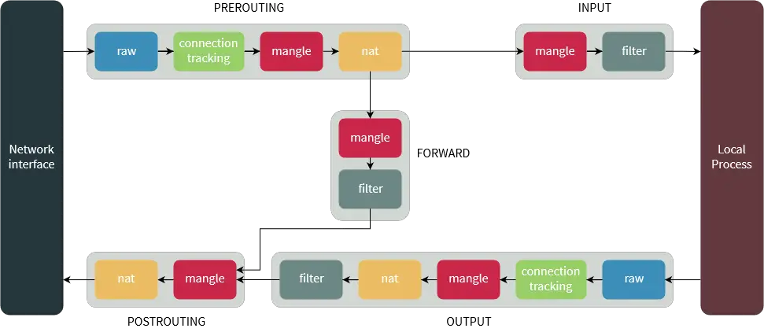

# Linux

This page will contain Linux and its tools notes.
## Up and Running
### Install a VM
Using VBOX to install a Virtual Machine (VM) and SSHing to it is the first step.
### Create a Github Repo
Git as a Version Control System (VCS) is an important tool that should be utilized.

#### Using ssh-agent to Connect to GitHub
It's better to use ssh keys. let's do it step-by-step.  
##### 1. Check for an Existing SSH Key
First, check if you already have an SSH key:

```sh
ls -al ~/.ssh
```

If you see files like `id_rsa` and `id_rsa.pub` (or `id_ed25519` and `id_ed25519.pub`), you already have an SSH key.

##### 2. Generate an SSH Key (if needed)
If you don’t have an SSH key, generate one:

```sh
ssh-keygen -t ed25519 -C "your_email@example.com"
```

Follow the prompts and save the key in `~/.ssh/id_ed25519` (or `~/.ssh/id_rsa`).

##### 3. Start the SSH Agent and Add the Key
Start the `ssh-agent`:

```sh
eval "$(ssh-agent -s)"
```

Add your SSH key to the agent:

```sh
ssh-add ~/.ssh/id_ed25519
```

##### 4. Add the SSH Key to GitHub
Copy the public key to your clipboard:

```sh
cat ~/.ssh/id_ed25519.pub
```

Go to [GitHub SSH Settings](https://github.com/settings/keys), click **New SSH Key**, and paste the key.

##### 5. Test the Connection
Run:

```sh
ssh -T git@github.com
```

If successful, you'll see:

```sh
Hi username! You've successfully authenticated, but GitHub does not provide shell access.
```

##### 6. Set SSH for Git
Ensure Git uses SSH:

```sh
git config --global user.name "Your Name"
git config --global user.email "your_email@example.com"
git remote set-url origin git@github.com:your-username/repository.git
```

Now, you can push and pull from GitHub securely using SSH! 
### Preparing VS Code
I think it is better to use `vs code` instead of `vim`. `vs code` is a user friendly, GUI app that make it easier to deal with text files. There are also many extensions to track codes in big projects.
### Working with Text Files
There are many powerful tools in linux that can be used in editing or displaying text files. `cat`, `tr`, `awk`, `cut`, `sort` and `uniq` are the most useful ones.
## Drive in Linux
### Introduction
Drives are known as physical disks used to permanently store data into them. The first step towards organizing the storage on a disk is `Disk Partitioning`. It involves dividing a disk into separate sections, each functioning as an independent disk, which can be managed separately. This segregation helps in managing files, running different operating systems on the same disk, or creating a dedicated space for specific data.  
There are three types of partitions:  
__1. Primary Partitions:__ Directly accessible and used for booting the system. A disk can have up to four primary partitions.  
__2 Extended Partitions:__ Created within a primary partition, acting as a container that can hold multiple logical partitions. This is a workaround for the four-partition limit.  
__3. Logical Partitions:__ Nested within an extended partition, allowing for more than four partitions on a disk.  
A partition table tells the operating system how the partitions and data on the drive are organized. Master Boot Record (MBR) and GUID Partition Table (GPT) are two types of partition tables. MBR is a bit of reserved space at the beginning of the drive that contains the information about how the partitions are organized. The MBR also contains code to launch the operating system, and it's sometimes called the Boot Loader. GPT is a newer standard that's slowly replacing MBR. Unlike an MBR partition table, GPT stores the data about how all the partitions are organized and how to boot the OS throughout the drive.  


| Partiotion Table | # of Primary Partitions | Max. of Disk Usage |
| :---: | :---: | :---: |
| MBR | Up to 4 | Up to 2 TB |
| GPT| Up to 128 |  Up to 1 bilion TB |

A __file system__ dictates how data is stored and retrieved. ==Each partition can use a different file system== (`ext4`, `NTFS`, `FAT32`, etc.), affecting performance, storage efficiency, and compatibility. 
As a general rule, `ext4` is better suited for handling a large number of small files, while `xfs` performs better when dealing with a smaller number of large files.  
Linux offers a plethora of tools for disk partitioning, including:  
__1. fdisk:__ A command-line utility ideal for MBR disks.
__2. gdisk:__ Similar to fdisk but for GPT disks.
__3. parted:__ A versatile tool that supports both MBR and GPT disks.
### Logical Volume Management

### Linux Commands

#### Example Scenario


## Firewall in Linux: `iptables`
The Linux kernel comes with a packet filtering framework named `netfilter`. It allows you to allow, drop and modify traffic leaving in and out of a system. A tool, `iptables` builds upon this functionality to provide a powerful firewall, which you can configure by adding rules. In addition, other programs such as `fail2ban` also use iptables to block attackers.  
Iptables relies on a set of `rules` organized into `chains` that determine the fate of incoming packets. It checks each packet against these rules to decide whether to **allow** it, **drop** it, or **forward** it to another `chain`. With iptables, you have full control over the network flow, allowing you to **filter**, **block**, or **shape** traffic as needed.  
###  Architectural Aspects of `iptables`
`iptables` rules was designed in a hierarchical architecture. There are 3 units: *table*, *chain* and, *rule*.

**Table:** The traffic packets are filtered based on **tables** that are managed by `iptables`.  
Most Linux distributions have four tables: `filter`, `mangle`, `nat`, and `raw`. The default is `filter`.  
**Chain:** Each table contains a set of rulers (or chains) that define what to do with each packet depending on its point (*input*, *output*, *forward*). So each table contains a few chains, such as `PREROUTING`, `INPUT`, `OUTPUT`, `FORWARD`, and `POSTROUTING`. The filter table by default contains the `INPUT`, `FORWARD`, and `OUTPUT` chains.  
**Rules:**  Each chain can contain rules to match specific packets based on type of traffic (e.g. tcp/udp/icmp), destination or source IP, port, etc. Each rule contains a target which determines what to do with packets that match the rule (e.g. accept or reject).  
**Target:** Each rule contains a target which determines what to do with packets that match the rule (e.g. accept or reject). The available targets are `ACCEPT`, `DROP`, and `REJECT`. The difference between `DROP` and `REJECT`, is that with `REJECT`, a ***connection reset*** for `TCP` and a ***destination host unreachable*** for `UDP/ICMP` is sent to the packet source, while `DROP` dictates that nothing is to be sent to the packet source.

---

For example, a rule in the OUTPUT chain may match to ==UDP packets that go out to port 53==, and the target may say that those packets should be dropped. 

### Basic Commands
`iptables` can be installed by:
```bash
sudo apt-get install iptables
```
Some basic commands are listed bellow:
`iptables -L`: View current rules.
`iptables -A`: Append a new rule to a chain.
`iptables -D`: Delete a rule from a chain.
`iptables -P`: Set default policy for a chain.
`iptables -F`: Flush all rules in a chain.

### `iptables` syntax and options:
An iptables command looks as follows:
```bash
iptables [options] [chain] [criteria] -j [target]
```
The table below contains common iptables options:

| Option | Description |
| :----:  | :---- |
| -A  <br>  --append | append a rule to a chain. |
| -C <br> --check	| Look for a rule that matches a chain. |
| -D <br> --delete | Remove a rule from a chain.|
|-F <br> --flush | Remove all rules.|
|-I <br> --insert |	Add a rule to a chain at the provided |position.
| -L <br> --list	| Show all rules in a chain.|
| -N <br> --new-chain |	Create a new chain.|
| -V <br> --verbose	| Show a more detailed output.|
| -X <br> --delete-chain	| Delete a chain.|


### Examples
 - Allow HTTPS Traffic
```bash
sudo iptables -A INPUT -p tcp --dport 443 -j ACCEPT
```
- Reject SSH Traffic
```bash
sudo iptables -A INPUT -p tcp --dport 22 -j ACCEPT
```

- Reject traffic from an IP address range
```bash
sudo iptables -A INPUT -m iprange --src-range [IP-address-range] -j REJECT
# for example
sudo iptables -A INPUT -m iprange --src-range 192.168.1.100-192.168.1.200 -j REJECT
```
- Enable IP Masquerading for Internet Access


```bash
sudo iptables -t nat -A POSTROUTING -o <IFNAME> -j MASQUERADE
```
The provided command is used to enable IP Masquerading, which is a form of network address translation (NAT) that allows devices on a private network to communicate with the internet using the public IP address of the gateway. This is commonly used in scenarios where you have a private network (e.g., a home or office network) and want to allow devices on that network to access the internet.


- Delete a specific rule
```bash
# list all rules:
sudo iptables -L --line-numbers
#Locate the line number of the firewall rule you want to delete:
#Replace [number] with the rule line number you want to remove in the command bellow
sudo iptables -D INPUT [number]
```
### Save The Rules
`iptables` doesn't save the rules - These are available aslong as the machine is up. To keep `iptables` firewall rules after reboot, install the persistent package:
```bash
sudo apt install iptables-persistent
```
Enable the service
```bash
sudo systemctl enable iptables
```
Save them
```bash
sudo netfilter-persistent save
```

### References and Further Readings
1 - [iptables Tutorial: A Beginner's Guide to the Linux Firewall](https://phoenixnap.com/kb/iptables-linux)  
2 - [What Is iptables and How to Use It?](https://medium.com/skilluped/what-is-iptables-and-how-to-use-it-781818422e52)  
3 - [An In-Depth Guide to iptables, the Linux Firewall](https://www.booleanworld.com/depth-guide-iptables-linux-firewall/)  
4 - [Linux for Network Engineers: iptables](https://netbeez.net/blog/linux-iptables/)  
5 - [Secure Your Network with iptables](https://medium.com/itversity/secure-your-network-mastering-iptables-command-0abd45ff7e9c)