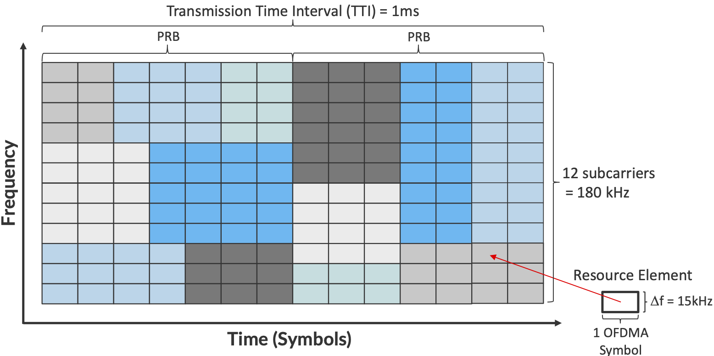
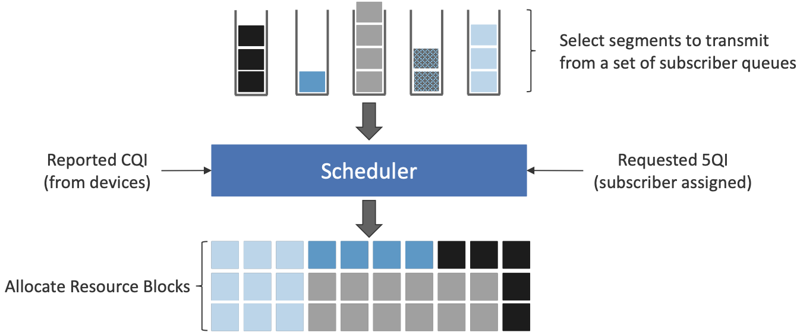
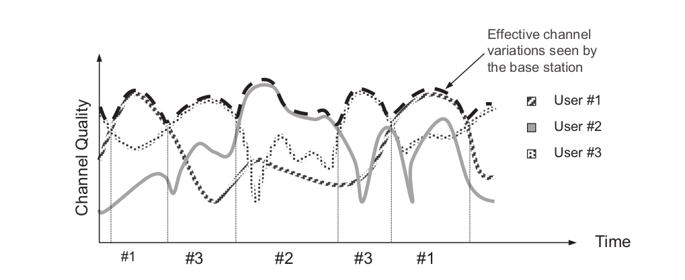

# Radio Access Network  
This page will contain concepts in Radio Access Network (RAN).
## Basic and Concepts
This section is the most topic that related to telecommunications.
### Scheduling
To investigate scheduling, it is better to start with **multiplexing** and **multiple access**.  
In communication systems, **multiplexing** and **multiple access** are two fundamental concepts that help manage and optimize resource allocation. Though they seem similar, they serve different purposes.  
Let's start with multiplexing

#### Multiplexing
**Multiplexing** is used when multiple signals need to be transmitted over a shared medium efficiently. The key idea is **pre-planned resource allocation**, meaning that bandwidth or time is divided among signals in a fixed way. So, in multiplexing it is **easy to coordinate** the senders.  
Multiplexing is used in a ==point-to-point situation== for example in backhaul, when different data sources come into one backhaul link and then go to its destiny:).  
There are 4 types of Multiplexing:  
- **TDM (Time Division Multiplexing):** Each signal gets a fixed time slot, even if it has nothing to send.  
- **FDM (Frequency Division Multiplexing):** Each signal is assigned a fixed frequency band.  
- **CDM (Code Division Multiplexing):** Each signal gets a unique code to separate it from others.  
- **SDM (Space Division Multiplexing):** Signals are separated based on different spatial paths (e.g., MIMO in wireless systems).  
To have a better understanding of multiplexing, *Applications of Multiplexing* table are prepared.  

| **Application** | **Multiplexing Type** | **Example** |
| :----------------: | :----------------: | ------------- |
| **Optical Networks (WDM)** | Wavelength Division Multiplexing (FDM) | Multiple light wavelengths transmitted in a fiber. |
| **Telephony (T1/E1 lines)** | TDM | Multiple voice calls transmitted over a single line. |
| **FM Radio** | FDM | Multiple stations operate at different frequency bands. |
 #### Multiple Access
**Multiple access** allows multiple users (UEs, devices) to share the available radio spectrum ==dynamically==. Unlike multiplexing, resources are **not permanently assigned** but are allocated **as needed**.
so despite of **multiplexing** ,which is about combining multiple signals into one channel **before transmission** and in a **single point-to-point link**, **Multiple Access** is about managing how multiple users share the spectrum **during transmission**.
Types of Multiple Access are listed below.  
- **FDMA (Frequency Division Multiple Access):** Each user gets a fixed frequency band.  
- **TDMA (Time Division Multiple Access):** Each user gets a time slot dynamically.  
- **CDMA (Code Division Multiple Access):** Users share the same frequency but have unique codes.  
- **OFDMA (Orthogonal Frequency Division Multiple Access):** Subcarriers are dynamically shared among users (used in LTE, 5G).  

Applications of Multiple Access are collected in the following table.  

| **Application** | **Multiple Access Type** | **Example** |
| :---------------: | :--------------: |-------------|
| **Mobile Networks (GSM, LTE, 5G)** | FDMA, TDMA, OFDMA, NOMA | UEs share frequency dynamically based on demand. |
| **Wi-Fi (CSMA/CA)** | Contention-based Access | Devices compete for access to the shared spectrum.   It is less coordinated than others.|
| **Satellite Communication** | CDMA, TDMA | Multiple ground stations communicate with the satellite. |

#### Scheduling
Multiple Access (MA) methods are used in RAN, as you know. But how to manage and coordinate users? Based on what? Who has the right to access the resources right now?  
These questions are answered by MAC layer but MA is done in PHY (because of spectrum, of course).  
MAC scheduling is a critical function in mobile networks that dynamically allocates radio resources (e.g., Physical Resource Blocks - PRBs) to UEs based on various parameters such as **QoS requirements, channel conditions, and traffic demand**. The goal of scheduling is to ==maximize network efficiency== while ensuring ==fairness== and ==QoS compliance==.  
##### Scheduling Basics, in 4G
The use of OFDMA naturally leads to conceptualizing the radio spectrum as a 2-D resource, as shown below, with the subcarriers represented in the vertical dimension and the time to transmit symbols on each subcarrier represented in the horizontal dimension. The basic unit of transmission, called a **Resource Element (RE)**, corresponds to a **15-kHz band around one subcarrier frequency** and the **time it takes to transmit one OFDMA symbol**. The number of bits that can be encoded in each symbol depends on the modulation scheme in use. For example, using Quadrature Amplitude Modulation (QAM), 16-QAM yields 4 bits per symbol and 64-QAM yields 6 bits per symbol. The details of the modulation need not concern us here; the key point is that there is a **degree of freedom to choose the modulation scheme** based on the measured **channel quality**, sending more bits per symbol (and thus more bits per second) when the quality is high.

A **scheduler** allocates some number of **REs** to each user that has data to transmit **during each 1 ms Transmission Time Interval (TTI)**, where users are depicted by different colored blocks in Figure above. The only constraint on the scheduler is that it must make its allocation decisions on blocks of **7x12=84 resource elements**, called a **Physical Resource Block (PRB)**. Figure shows shows two back-to-back PRBs. Of course time continues to flow along one axis, and depending on the size of the available frequency band (e.g., it might be 100 MHz wide), there may be many more subcarrier slots (and hence PRBs) available along the other axis, so the scheduler is essentially preparing and transmitting a sequence of PRBs.  

Note that OFDMA is not a coding/modulation algorithm, but instead provides a **framework** for selecting a specific coding and modulation for each subcarrier frequency. QAM is one common example modulation. ==It is the scheduler’s responsibility to select the modulation to use for each PRB, based on the **CQI feedback** it has received.== The scheduler also selects the **coding** on a per-PRB basis, for example, by how it sets the parameters to the turbo code algorithm.

The 1-ms TTI corresponds to the time frame in which the scheduler receives feedback from users about the quality of the signal they are experiencing. **This is the role of CQI: once every millisecond, each user sends a set of metrics, which the scheduler uses to make its decision as to how to allocate PRBs during the subsequent TTI**.

Another input to the scheduling decision is the **QoS Class Identifier (QCI)**, which indicates the quality-of-service each class of traffic is to receive. In 4G, the QCI value assigned to each class (there are twenty six such classes, in total) indicates whether the traffic has a **Guaranteed Bit Rate (GBR)** or not **(non-GBR)**, plus the class’s relative priority within those two categories. (Note that the 5QI parameter serves the same purpose as the QCI parameter in 4G.)

Finally, keep in mind that Figure above focuses on scheduling transmissions from a single antenna, but the MIMO technology described above means the scheduler also has to determine **which antenna (or more generally, what subset of antennas)** will most effectively reach each receiver. But again, in the abstract, the scheduler is charged with allocating a sequence of Resource Elements.

Note that the scheduler has many degrees of freedom: it has to decide **which set of users to service during a given time interval**, **how many resource elements to allocate to each such user**, **how to select the coding and modulation levels**, and **which antenna to transmit their data on**. This is an ==*optimization problem*== that, fortunately, we are not trying to solve here.
##### Scheduling in 5G
Fundamentally, 5G defines a family of waveforms —unlike LTE, which specified only one waveform— each optimized for a different band in the radio spectrum.
- **The bands with carrier frequencies below 1 GHz** are designed to deliver **mobile broadband and massive IoT services with a primary focus on range**.
- **Carrier frequencies between 1-6 GHz** are designed to offer wider bandwidths, focusing on **mobile broadband and mission-critical applications**.
- **Carrier frequencies above 24 GHz (mmWaves)** are designed to provide **super-wide bandwidths over short, line-of-sight coverage.**  

These different waveforms affect the scheduling and subcarrier intervals (i.e., the `size` of the resource elements ).  
- For frequency ==range 1 (410 MHz - 7125 MHz)==, 5G allows **maximum 100 MHz** bandwidths. In this case, there are three waveforms with **subcarrier spacings (SCS) of 15, 30 and 60 kHz**. (We used 15 kHz in the example shown in Figure above.) The corresponding to scheduling intervals of **0.5, 0.25, and 0.125 ms**, respectively. (We used 0.5 ms in the example shown in figure above).  
- For ==millimeter bands, also known as frequency range 2 (24.25 GHz - 52.6 GHz)==, bandwidths may go from **50 MHz up to 400 MHz**. There are two waveforms, with subcarrier spacings of **60 kHz and 120 kHz**. Both have **scheduling intervals of 0.125 ms**.  
These various configurations of *subcarrier spacing* and *scheduling intervals* are sometimes called the **numerology** of the radio’s air interface.  

This *range of numerology* is important because it adds another degree of freedom to the scheduler. In addition to allocating radio resources to users, it has the ability to **dynamically adjust the size of the resource by changing the waveform being used**. With this additional freedom, **fixed-sized REs are no longer the primary unit of resource allocation**. We instead use more abstract terminology, and talk about allocating Resource Blocks to subscribers, where the 5G scheduler determines both the size and number of Resource Blocks allocated during each time interval.  
Figure below depicts the role of the scheduler from this more abstract perspective. Just as with 4G, **CQI** feedback from the receivers and the **5QI quality-of-service class** selected by the subscriber are the two key pieces of input to the scheduler. Note that the set of 5QI values available in 5G is considerably greater than its QCI counterpart in 4G, reflecting the increasing differentiation among classes that 5G aims to support. For 5G, each class includes the following attributes:

- **Resource Type:** Guaranteed Bit Rate (GBR), Delay-Critical GBR, Non-GBR  
- **Priority Level**  
- **Packet Delay Budget**  
- **Packet Error Rate**  
- **Maximum Data Burst**  
- **Averaging Window**  

Note that while the preceding discussion could be interpreted to imply a one-to-one relationship between subscribers and a 5QI, it is more accurate to say that **each 5QI is associated with a class of traffic** (often corresponding to some type of application), where **a given subscriber might be sending and receiving traffic that belongs to multiple classes at any given time**.  

#### Types of Scheduling
So we know that mobile radio communication experiences **rapid and unpredictable channel variations** due to **frequency-selective fading, path loss, and interference**. To optimize resource utilization, techniques like **channel-dependent scheduling**, **link adaptation**, and **hybrid ARQ** are used.  
- **Channel-dependent scheduling** allocates radio resources dynamically to maximize efficiency, ensuring **minimum resource usage per user** while **meeting QoS requirements**.  
- **Link adaptation** adjusts transmission parameters (e.g., power, modulation, and coding) based on **channel conditions** to maintain efficient data transfer.  
- **Hybrid ARQ** provides **error correction** by requesting **retransmissions of corrupted data**, complementing scheduling and link adaptation.  
  
##### Link Adaptation: Power vs. Rate Control  

- Power Control (used in CDMA) **adjusts transmit power to maintain a constant signal-to-noise ratio (SNR)**, ensuring stable transmission.  
- Rate Control (adaptive modulation and coding, AMC) **adjusts data rates instead of power, making better use of transmission power**. Higher modulation schemes (e.g., 16QAM, 64QAM) are used in good conditions, while lower ones (e.g., QPSK) are used in poor conditions. The data rate should be high as possible.  

 Power control (top) and (b) rate control (bottom)")

##### Channel-Dependent Scheduling
Scheduling determines **how shared radio resources are allocated among users**. In downlink scheduling, transmissions can be orthogonal in time (TDM), frequency (FDM), or code (CDM). There are 3 approach:  
- **Max-C/I Scheduling** prioritizes **users with the best channel conditions**, maximizing system capacity but *potentially starving users with poor conditions*.  
- **Round-Robin Scheduling** assigns **equal time to all users**, ensuring fairness but reducing efficiency.  
- **Proportional-Fair Scheduling** balances throughput and fairness by scheduling users based on both **instantaneous and average channel conditions**.  
A practical scheduler must exploit fast channel variations for efficiency while maintaining fairness across users, often using a combination of TDM, FDM, and CDM.

The first picture shows the Max-C/I Scheduling and the second one shows all three methods.  

 max C/I, (b) round robin, and (c) proportional fair. The selected user is shown with bold lines")

#### References and Further Readings
1 - [Private 5G: a System Approach, Chapter 3: Radio Transmission](https://5g.systemsapproach.org/radio.html#chapter-3-radio-transmission)  
2 - [The Difference Between Multiplexing and Multiple Access](https://www.youtube.com/watch?v=qOrxiRNqRRY)  
3 - [OAI's mac-usage.md](https://gitlab.eurecom.fr/oai/openairinterface5g/-/blob/feature-time-manager/doc/MAC/mac-usage.md)  
4 - [4G: LTE/LTE-Advanced for Mobile Broadband](https://books.google.de/books/about/4G_LTE_LTE_Advanced_for_Mobile_Broadband.html?id=DLbsq9GD0zMC&redir_esc=y)

## Architecture
RAN Architecture and its evolution!  
## Protocol Stack
How 5G stuff works?
