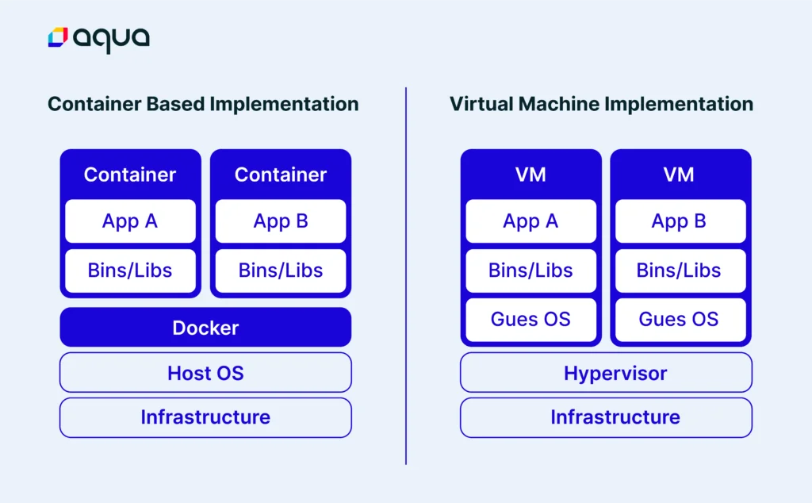
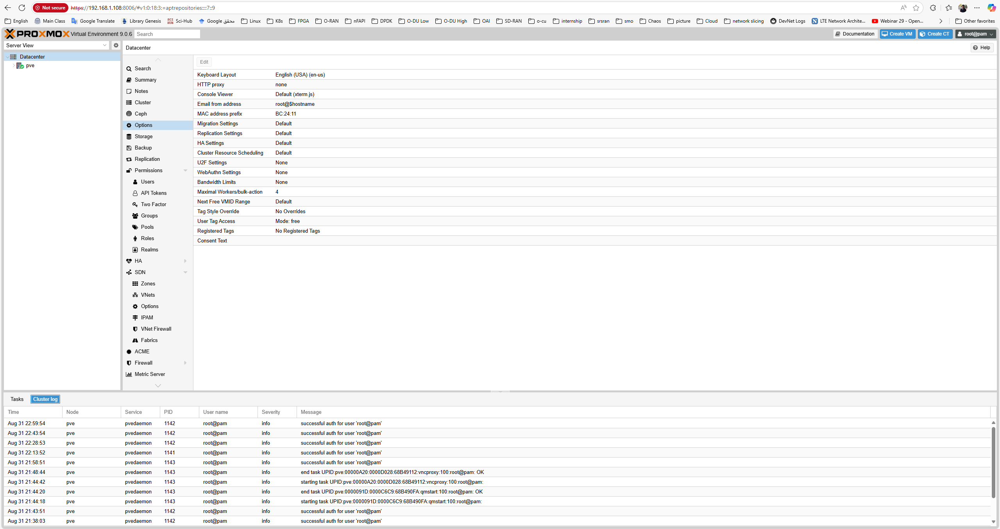
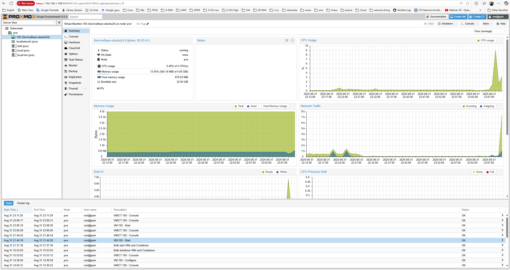

# Virtualization

This page will contain information about virtualization in computing systems.

- [Virtualization](#virtualization)
  - [Definitions](#definitions)
    - [Types of Virtualization](#types-of-virtualization)
    - [Hypervisors](#hypervisors)
    - [Containers vs Virtual Machines](#containers-vs-virtual-machines)
    - [Scaling in Virtualized Environments](#scaling-in-virtualized-environments)
    - [Virtualization Tools and Ecosystem](#virtualization-tools-and-ecosystem)
    - [References and Further Readings](#references-and-further-readings)
  - [Virtual Machines](#virtual-machines)
    - [Install Proxmox](#install-proxmox)
      - [Download files](#download-files)
      - [Create a bootable USB with Rufus (on Windows)](#create-a-bootable-usb-with-rufus-on-windows)
      - [BIOS/UEFI setup on the old PC](#biosuefi-setup-on-the-old-pc)
      - [Install Proxmox VE](#install-proxmox-ve)
      - [First login (Web UI)](#first-login-web-ui)
      - [Post-install housekeeping (no subscription repo)](#post-install-housekeeping-no-subscription-repo)
      - [Storage layout (use multiple disks)](#storage-layout-use-multiple-disks)
      - [Upload a Linux ISO and create the first VM (Ubuntu example)](#upload-a-linux-iso-and-create-the-first-vm-ubuntu-example)
        - [Upload ISO](#upload-iso)
        - [Create VM](#create-vm)
        - [Scale Up The Storage](#scale-up-the-storage)


## Definitions

Virtualization is the process of creating an __abstract layer__ between hardware resources and the software that uses them. Instead of applications directly accessing physical hardware, a virtualization layer (hypervisor or container runtime) allows multiple __isolated environments__ to share the __same physical system__ efficiently. Using it lets us fully utilize hardware capabilities and makes disaster recovery easier. However, it introduces some security risks and software licensing costs.  

### Types of Virtualization

- **Hardware Virtualization:** Full virtual machines (VMs) with dedicated virtual CPUs, memory, disks, and NICs.

- **Operating System Virtualization:** Containers running on a shared kernel while remaining isolated from each other (e.g., Docker, Podman, LXC).

- **Storage Virtualization:** Abstracting storage resources into pools for flexible provisioning.

- **Network Virtualization:** Overlay networks and SDN (Software-Defined Networking) to decouple network services from hardware.

### Hypervisors

- __Type 1 (Bare-metal):__ Run directly on the hardware (e.g., `VMware ESXi`, `Proxmox VE`, `Xen`, `Hyper-V`).

- __Type 2 (Hosted):__ Run on top of a host operating system (e.g., `VirtualBox`, `VMware Workstation`).

### Containers vs Virtual Machines

- __VMs:__ Each VM runs its own guest OS, providing full isolation and flexibility but with higher overhead.

- __Containers:__ Share the host OS kernel, lightweight and faster, ideal for microservices and DevOps workflows.


_Virtualization types: Container-based and VM-based -- Reference: [aquasec.com](https://www.aquasec.com/cloud-native-academy/docker-container/containerization-vs-virtualization/)_


### Scaling in Virtualized Environments

- __Scale Up (Vertical Scaling):__ Adding more resources (CPU, RAM, storage) to a single VM or container. Example: resizing a VM disk using `fdisk`, `vgextend`, `lvextend`, and `resizefs`.

- __Scale Out (Horizontal Scaling):__ Adding more VMs or containers to distribute workload across multiple nodes. Common in `Kubernetes` or cloud-native architectures.

### Virtualization Tools and Ecosystem

__Hypervisors:__ `Proxmox VE`, `VMware ESXi`, `KVM`, `Xen`.

__Container Runtimes:__ `Docker`, `Podman`, `containerd`.

__DevOps & Orchestration:__ `Terraform` (infrastructure as code), `Ansible` (automation), `Kubernetes` (orchestration), `GitLab CI`, `Nexus` (artifact repository).


### References and Further Readings
1. [Virtualization in Cloud Computing and Types](https://www.geeksforgeeks.org/cloud-computing/virtualization-cloud-computing-types/)  
2. [Virtualization - TechTarget](https://www.techtarget.com/searchitoperations/definition/virtualization)  
3. [Containerization vs. Virtualization: Key Differences and Use Cases](https://www.aquasec.com/cloud-native-academy/docker-container/containerization-vs-virtualization/)

## Virtual Machines
Virtualization on a host OS is old hat and not very exciting anymore. My first stop was VMware ESXi, but hardware limitations made it frustrating. That’s when I shifted to Proxmox VE, and it clicked immediately. Open-source, lightweight, community-driven — and it just worked with my old hardware. So let's begin with installing Proxmox.

### Install Proxmox
#### Download files

Proxmox VE ISO: from the official Proxmox site (Downloads → ISO Images).  
Rufus (to make a USB installer): download from rufus.ie (portable EXE, no install needed).  
#### Create a bootable USB with Rufus (on Windows)
Insert an 8 GB+ USB stick (it will be erased).  
Open Rufus → Device: your USB.  
Boot selection: pick the Proxmox ISO you downloaded.  
Partition scheme:  
- MBR if the target PC boots in Legacy BIOS.  
- GPT if the PC boots in UEFI.  
Leave File system = FAT32, Cluster size = default.  
Click Start → OK to write in ISO mode.  
#### BIOS/UEFI setup on the old PC
Consider these points:  
- Enable Intel VT-x/AMD-V (virtualization).  
- (If present) enable VT-d/IOMMU.  
- Disable Secure Boot (older hardware may not have this).  
- Set USB as the first boot device (or use the one-time boot menu key).  
#### Install Proxmox VE
First considerations:  
- Boot from the USB → choose Install Proxmox VE (Graphical).  
- License: accept.  
- Target disk: pick your SSD (fastest).  
- File system: choose LVM/ext4 (recommended for 16 GB RAM). Avoid ZFS on low RAM.  
- Country/Time/Keyboard: set yours.  
- Password & Email: set root password (this is for Proxmox login).  

Management network:  
- Pick your NIC (e.g., enp3s0/eth0).  
- Set a Static IP if possible (recommended), e.g.  
  - IP: 192.168.1.100  
  - Netmask: 255.255.255.0  
  - Gateway: 192.168.1.1 (your router)  
  - DNS: your router or 1.1.1.1  

Install → Reboot → remove USB.  

#### First login (Web UI)

On another machine on the same LAN, open:  
`https://<your-proxmox-node-ip>:8006` (e.g., `https://192.168.1.100:8006`)  
Ignore the certificate warning (self-signed).  
Login: root + the password you set.  


_Proxmox First Login on the Web UI_  
#### Post-install housekeeping (no subscription repo)
By default, Proxmox points to the enterprise repo (requires a subscription). Switch to the free repo:  
Open Shell in the Web UI (top-right) or SSH to the node, then:  
 - Disable the enterprise repo:

 Go to Web UI, from the left panel, choose node (here `pve`) -> Updates -> Repositories. Select `pve-enterprise-sources` and `ceph-sources`, and disable them.  
 - Enable the no-subscription repo (Proxmox VE 8.x on Debian 13 `trixie`):

 Open a shell, `editor /etc/apt/sources.lists.d/pve-no-subscription` and paste following content:  
 ```
deb http://download.proxmox.com/debian/pve trixie pve-no-subscription
 ```
Now, You can update and upgrade the OS:  
 ```
apt update
apt full-upgrade -y
reboot
```

After reboot, you’re on the latest Proxmox VE 8 (free/no-subscription).  

#### Storage layout (use multiple disks)

__local-lvm (thin):__ default place for VM disks (lives on the SSD—fast).  

__local:__ for ISO images & backups (also on SSD by default).  

To add any other drive for VM disks/ISO/backups:  

`Datacenter → <node> → Disks → Directory → Create`  

Point it to your drive (e.g., `/mnt/hdd1`), format `ext4`, give it an ID (e.g., `hdd-dir`).  

Then go to `Datacenter → Storage → Add → Directory`, pick that path and enable `Disk image and/or ISO image` as you like.  

#### Upload a Linux ISO and create the first VM (Ubuntu example)

##### Upload ISO

`Datacenter → <node> → local (Storage) → ISO Images → Upload → pick ubuntu-XX.YY-server.iso.`  

##### Create VM

Create VM (top-right).  

- **General:** Name it (e.g., ubuntu01).  
- **OS:** Select the uploaded ISO.  
- **System:** Keep defaults (BIOS SeaBIOS is fine for old PCs).  
-  **Hard Disk:** SCSI, on local-lvm, size e.g., 40 GB.  
- **CPU:** Host type, 2 cores.  
- **Memory:** 4096 MB (4 GB).  
- **Network:** Bridge vmbr0; Model VirtIO (paravirtualized).  

Before first boot: `VM → Options → QEMU Guest Agent → Enable = Yes.`  
Start the VM: `Console → install Ubuntu` (tick `OpenSSH server` during install).  

Inside the VM after first boot:  
```
sudo apt update
sudo apt install -y qemu-guest-agent
sudo systemctl enable --now qemu-guest-agent
```

Now you can SSH in from your LAN:  
```
ssh <username>@<vm-ip>
```

(Find the VM’s IP in Proxmox summary once the guest agent isactive on the VM config and is running (`apt-get install qemu-guest-agent`) in the VM OS, or simply via `ip a` in the VM shell.)  

_First VM Stats in Proxmox_  

##### Scale Up The Storage
First of all, add a new disk from VM hardware panel. After that you can see this on the `lsblk` command output. if its name is `/dev/sdb`, use `fdisk /dev/sdb` command to format this. you have to press `n` to create new filesystem, `p` for primary, and some `enter` keys to confirm default values. after that, you can use `t` to change type of it to `8e` i.e.  `linux-lvm`.  

You can think of LVM as "dynamic partitions": it lets you create, resize, and delete logical volumes from the command line while Linux is running, so the kernel immediately recognizes the changes without a reboot.  
LVM lets you merge physical volumes into volume groups and then create, resize, or delete logical volumes as flexible partitions.  
So the structure is made up with 3 entity:  
- **Physical Volumes (`pv`)**: physical block devices (or device-mapper devices) with an LVM header - the raw building blocks.  
- **Volume Groups (`vg`):** pools that combine physical volumes into a single logical storage pool.  
- **Logical Volumes (`lv`):** flexible “partitions” carved from a volume group that users and applications use.  

to read new partitions use `sudo partprobe`, then you can create a PV by prompting `sudo pvcreate /dev/sdb1`. To extend `ubuntu-vg` Volume Group and `lv-0` Logical Volume:  
```
sudo vgextend ubuntu-vg /dev/sdb1
lvextend -l +100%FREE  /dev/ubuntu-vg/lv-0
```
Then you can resizes the filesystem on the logical volume to match the LV’s new size and check it.  
```
resize2fs /dev/ubuntu-vg/lv-0
df -h
```
You’re all set - once the filesystem resize completes and you verify the new size with `df -h`, the extra space from the added disk is available to the system and applications immediately. This lets you grow storage __on the fly__ without downtime, and you can repeat the same `PV → VG → LV` steps later if you add more disks or need to reallocate space.  
